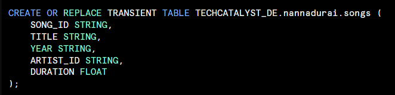
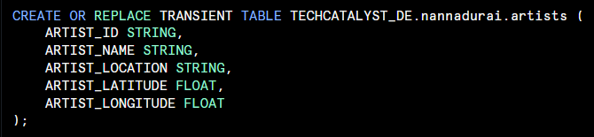
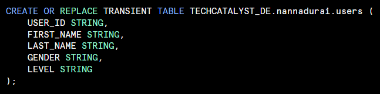
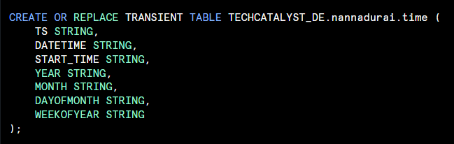
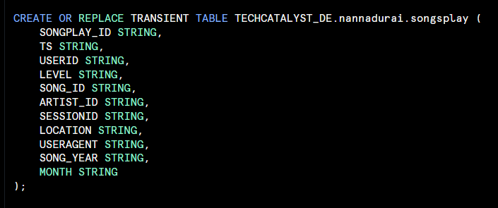

# Mini Project Writeup

### Design Diagram

### Context 
---

  In this activity, we looked at utilizing the concepts of data lake and data warehouse to help Sparkify understand how to grow their user base by generating insights into what current users are listening to.

  

#### Data Lake

First, the source data from S3 had to be extracted and processed through Databricks using Apache Spark. In this process, song data stored in JSON files as well as log data JSON files were imported into Databricks using PySpark. Data was processed to create separate songs, artists, users, time, and songplay tables. In conjunction, Sparkify is able to look at different aspects about their users and their song choices to make insight driven decisions for their business. The tables includes the following:

#### Data Warehouse

Once tables were created, they were partitioned and written to S3 in the form of Parquet files. These were subsequently read from S3 in Snowflake through an external stage. This allowed us to read to tables and insert them into transient tables within S3, which will be used for further analytics by Sparkify.

---
---

### ETL Pipeline and Schema Design

---

Various columns were extracted from original data to create dimemnsion and fact tables:

#### Songs Table:
* <code>song_id string</code>
* <code>title string</code>
* <code>artist_id string</code>
* <code>year number</code>
* <code>duration float</code>

#### Artists Table:
* <code>artist_id string</code>
* <code>artist_name string</code>
* <code>artist_location string</code>
* <code>artist_latitude string</code>
* <code>artist_longitude string</code>

#### User Table:
* <code>user_id string</code>
* <code>firstName string</code>
* <code>lastName string</code>
* <code>gender string</code>
* <code>level string</code>

#### Time Table:
* <code>ts number</code>
* <code>datetime string</code>
* <code>start_time string</code>
* <code>year number</code>
* <code>month number</code>
* <code>dayofmonth number</code>
* <code>weekofyear number</code>

#### Songplay Table:
* <code>songplay_id number</code>
* <code>ts number</code>
* <code>user_id string</code>
* <code>level string</code>
* <code>song_id string</code>
* <code>artist_id number</code>
* <code>sessionId number</code>
* <code>location string</code>
* <code>userAgent string</code>
* <code>song_year number</code>
* <code>month number</code>

---
---

### DDL Scripts
---

#### Song Table

#### Artists Table

#### Users Table

#### Time Table

#### Songplay Table

